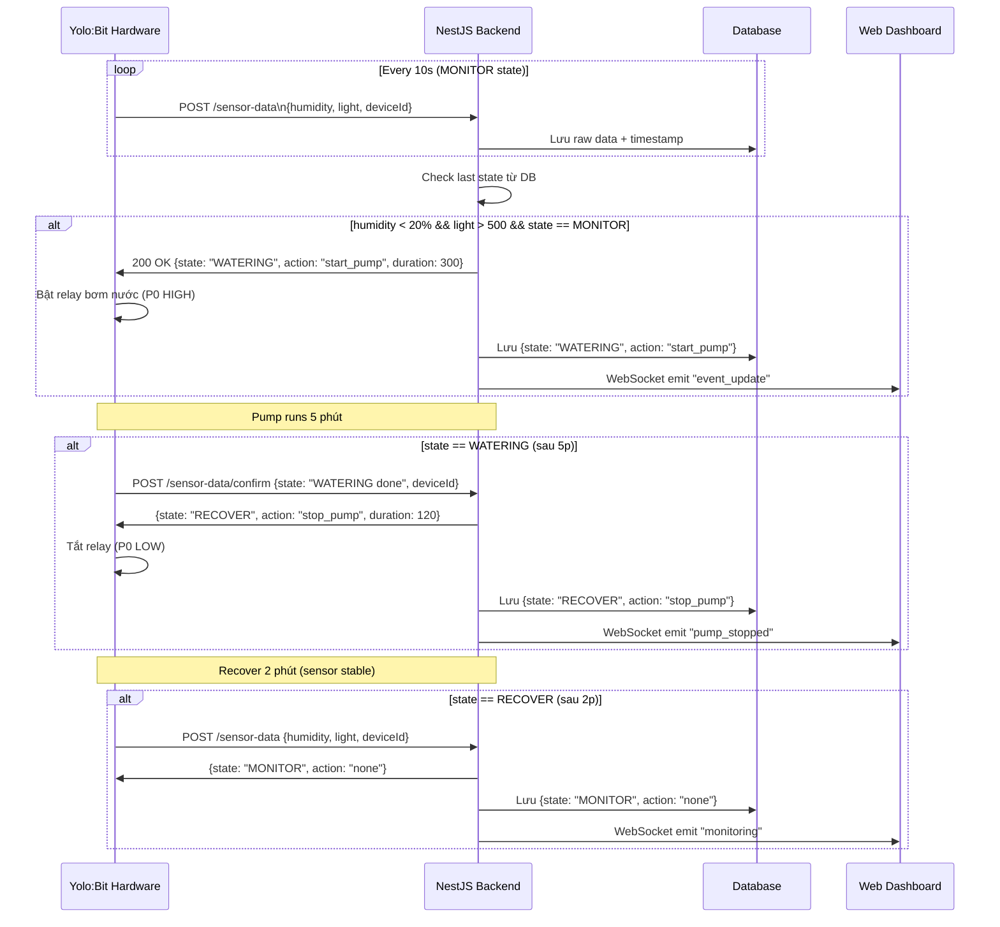
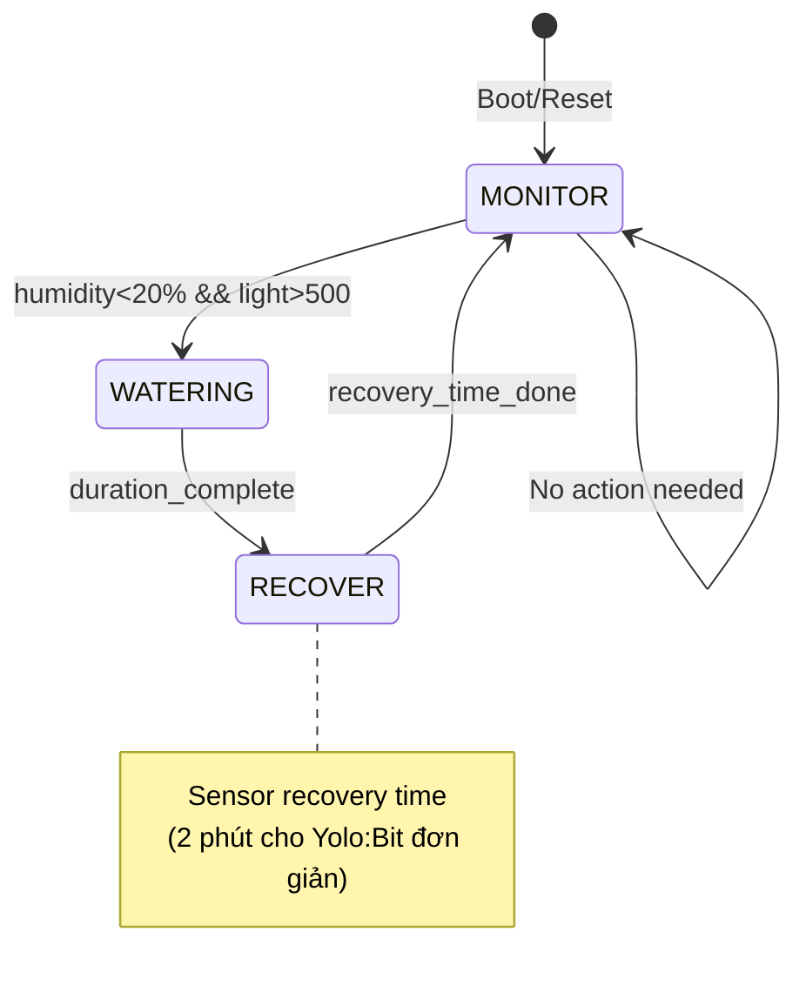

# Event Chaining Flow Documentation

## Tổng quan Event Chaining

Event chaining là **sequential decision-making process** với 3 trạng thái tuần tự bắt buộc: **MONITOR → WATERING → RECOVER**, được thiết kế để xử lý sensor recovery time trong smart agriculture.

- MONITOR: nhận sensor data định kỳ, kiểm tra điều kiện kích hoạt tưới.
- WATERING: bơm chạy 5 phút.
- RECOVER: chờ 2 phút để sensor ổn định trước khi quay lại MONITOR.

## Flow chi tiết từ Hardware → BE → FE

## State Machine chính xác

## Backend Logic (NestJS)

- Endpoint hardware:
  - `POST /sensor-data`
  - `POST /sensor-data/confirm`
- State lưu theo `deviceId` trong collection `device_states`.
- Log chuỗi trạng thái trong collection `event_logs`.
- Realtime FE qua WebSocket namespace `/events` với các event:
  - `state_change`
  - `event_update`
  - `pump_stopped`
  - `monitoring`

## Database Collections

### `device_states`

- `deviceId`: định danh thiết bị (unique)
- `state`: `MONITOR | WATERING | RECOVER`
- `stateStartedAt`: thời điểm bắt đầu state hiện tại
- `wateringEndsAt`: mốc kết thúc WATERING
- `recoverEndsAt`: mốc kết thúc RECOVER
- `updatedAt`

### `event_logs`

- `deviceId`
- `humidity`
- `light`
- `state`
- `action`
- `timestamp`
- `metadata` (traceId, trigger, duration, ...)

## Key Characteristics

✅ **Sequential**: Bắt buộc `MONITOR → WATERING → RECOVER`.

✅ **Recovery Time**: 2 phút chờ sensor ổn định.

✅ **State Persistence**: DB tracking theo `deviceId`.

✅ **Realtime**: WebSocket notify FE tức thời.

✅ **Fault Tolerant**: Hardware có timer backup, backend vẫn enforce state duration.
